**大家好，我是卡卡罗特。**

最近一个礼拜，OpenAI持续更新，Codex的功能越来越强了，但是风控持续在升级。

导致使用Codex也越来越麻烦了。

白嫖OpenAI首月免费的成本越来越高了，难受~

<!-- 这是一张图片，ocr 内容为：硬撑 -->

之前我写了一篇文章，通过JSON格式文件的方式绕过Codex的登录验证手机号。

但是现在已经没用了。

<!-- 这是一张图片，ocr 内容为： -->

但是Cookpit Tool这个软件依然很有用，比如说可以帮你管理多个ChatGPT账号。当然还可以管理其他的，比如说Google的反重力、Claude....。

这里不再展开了

**那现在Codex登入要验证手机号怎么办呢？**

<!-- 这是一张图片，ocr 内容为：思索 -->

那我们就给它绑定一个手机号。

填国内的手机号肯定是不行的，那你就要用一个**国外的手机号**。

拥有一个国外的手机号，比较麻烦。

但是有些平台可以给你一个**临时号码接收短信**，这种平台叫**接码平台**。

比如HeroSMS这个平台。

<!-- 这是一张图片，ocr 内容为：HERISMS 充值 关于我们 忠诚计划 我的号码 获取号码 合作伙伴 中文 API 在线接收短信&API访问 在线接收发送到虚拟号码的短信.可直接在网站使用或通过API接口 来注册各类服务与应用账户,获取收益与折扣 市场领先的接码软件(由 SMS-ACTIVATE 技术基础设施提供支持) 其他人购买,你赚钱 全球覆盖范围:180多个国家 加入网站联盟 仅限可靠供应商:每日提供50万多个号码 更多 接收短信 获取API密钥 -->
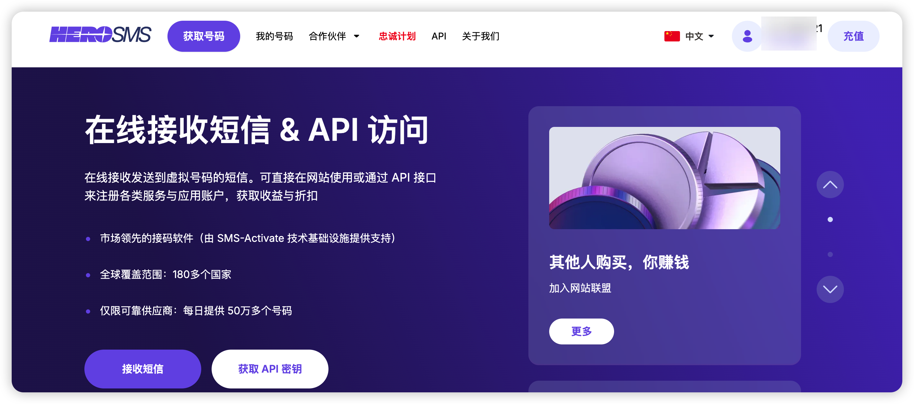

这个平台支持微信、支付宝支付，还是很方便的。

下面开始教程。

<!-- 这是一张图片，ocr 内容为：开炮! -->

## 1、注册
上面说的HeroSMS这个接码平台，✅地址是这个：[<u>https://hero-sms.com/</u>](https://hero-sms.com/)

<!-- 这是一张图片，ocr 内容为： -->
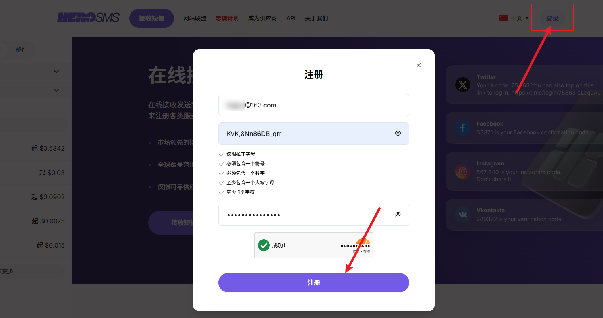

点击右上角的登录，然后注册一个新的账号。我这里直接用163邮箱注册即可。

## 2、选择OpenAI
> **顺便一提：**ChatGPT的母公司叫OpenAI。
>

在页面左边选择服务，搜索输入OpenAI。

<!-- 这是一张图片，ocr 内容为： -->
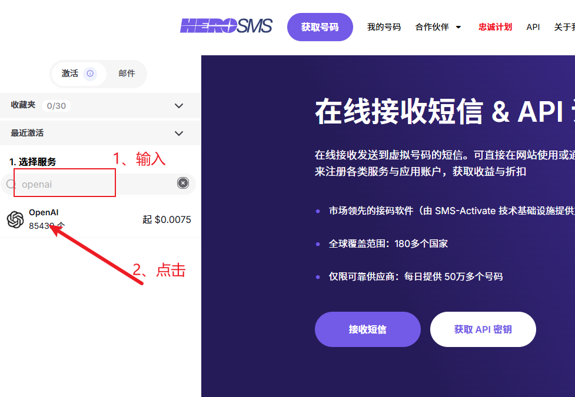

OpenAI支持其他很多国家的短信。

HeroSMS也支持多个国家，但是有些国家接码可能会失败（**接码失败平台会自动退款**）。

那我们就点击这个**热门国家**，这里可以看到各个**国家的成功率排行榜**。

<!-- 这是一张图片，ocr 内容为： -->
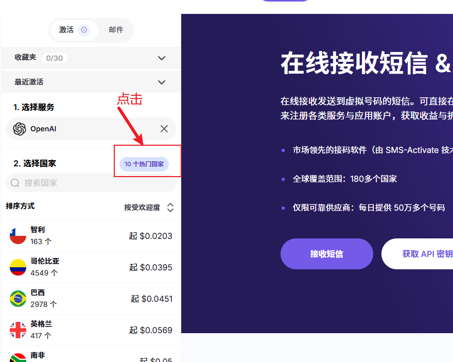

在下面这张图可以看到各个国家成功率排行，可以看出泰国的成功率是最高的。

<!-- 这是一张图片，ocr 内容为： -->
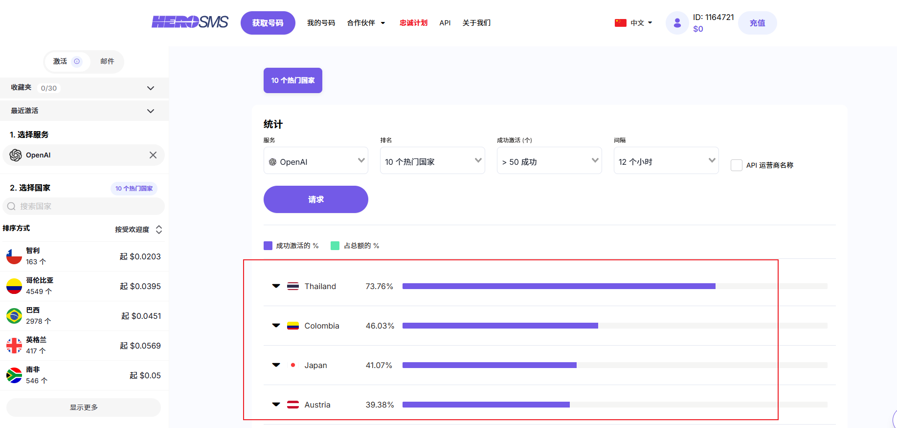

## 3、选择接码国家
那我们这里直接选择泰国的手机号接收短信。（**<u>选择美国也可以</u>**）

我们发现需要1.7刀，换算成人民币差不多11块，**好贵！**😅

<!-- 这是一张图片，ocr 内容为：偷偷抹泪 -->

<!-- 这是一张图片，ocr 内容为： -->
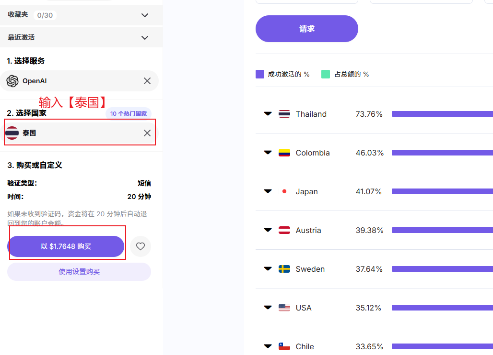

## 4、充值
你点击购买的时候，发现买不了，因为你的账户没钱😅

<!-- 这是一张图片，ocr 内容为： -->

点击右上角的充值按钮进行充值。

<!-- 这是一张图片，ocr 内容为： -->
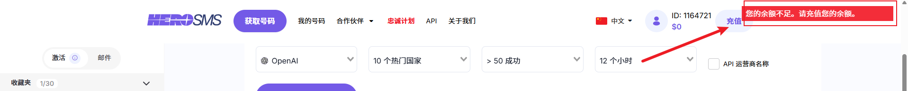

充值这里直接选下面这个支付宝，**这个佣金最少。**

<!-- 这是一张图片，ocr 内容为： -->
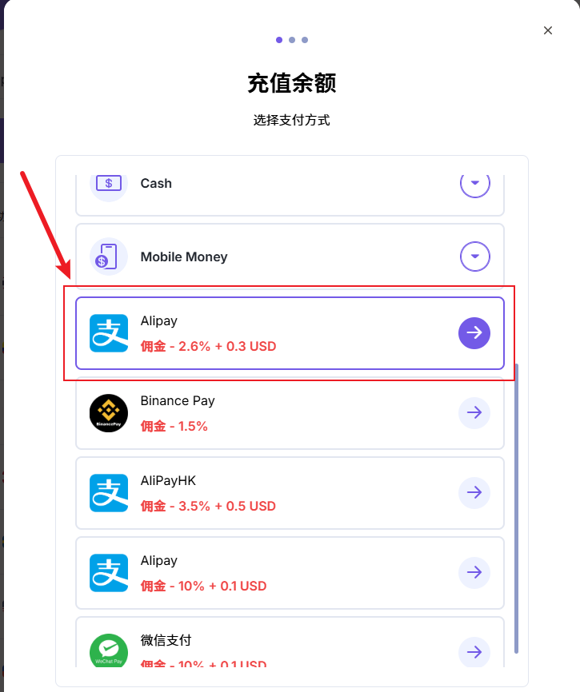

支付宝充值最少要充2美元（**<u>这里货币单位是USD，可以理解成美元</u>**）。

**<u>那就先充个最低的2美元吧，大概14块人民币。</u>**

<!-- 这是一张图片，ocr 内容为： -->
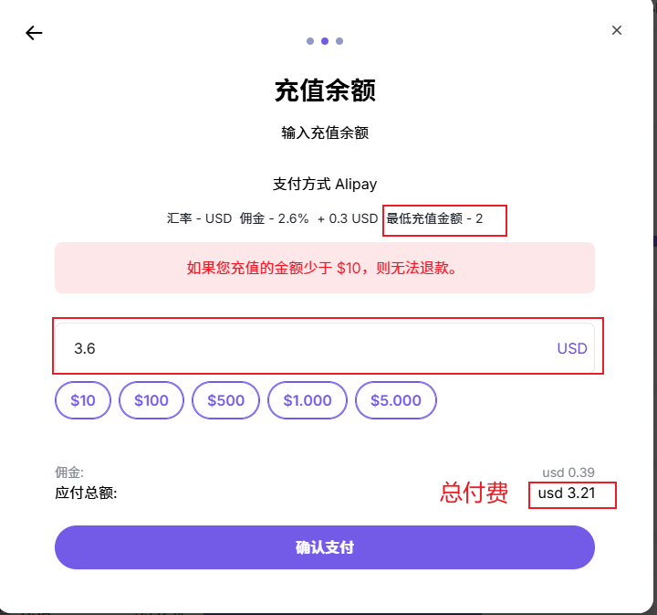

然后跳转到下面这个页面，**先不要支付宝扫码，点击下面的查看链接。**

<!-- 这是一张图片，ocr 内容为： -->
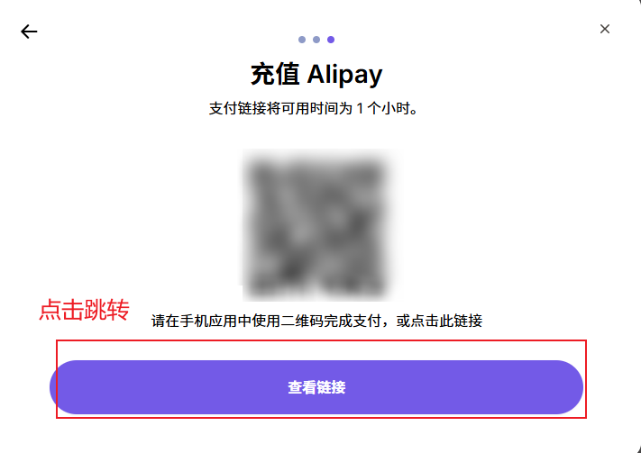

跳转到下面这个页面，再用支付宝扫码支付。

<!-- 这是一张图片，ocr 内容为： -->
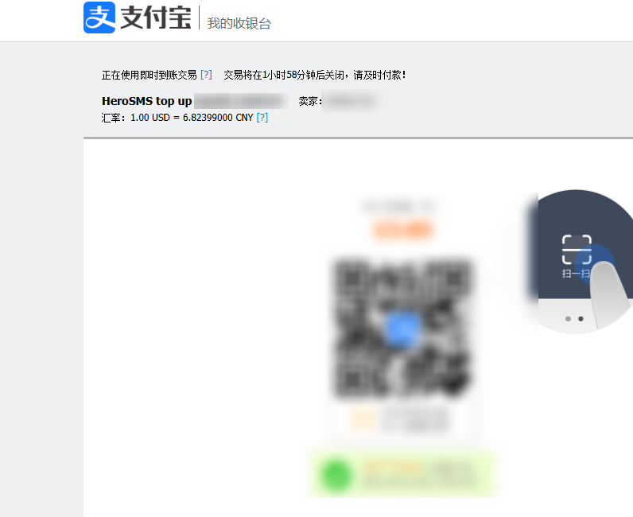

## 5、购买手机号
回到第三步进行购买手机号**（这里价格突然变成了1.08美元，我也不知道为什么****🤔****）**

**点一下就直接购买了（竟然没有确认按钮****😅****），然后右边就有一个手机号。**

<!-- 这是一张图片，ocr 内容为： -->
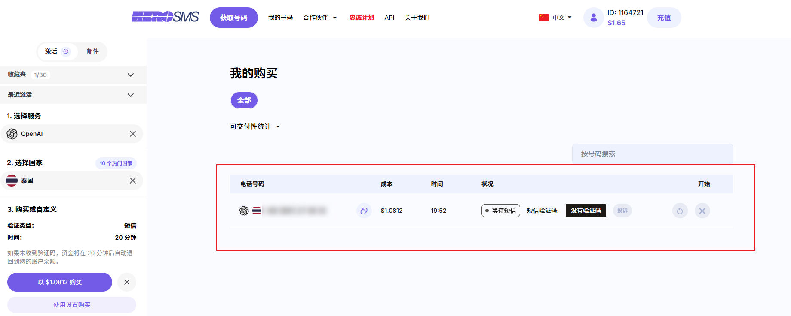

## 6、Codex登入
让我们回到Codex，然后继续登录。

<!-- 这是一张图片，ocr 内容为：欢迎使用CODEX 所有CHATGPT套餐均包含 使用CHATGPT继续 使用其他方式登录 注册 -->
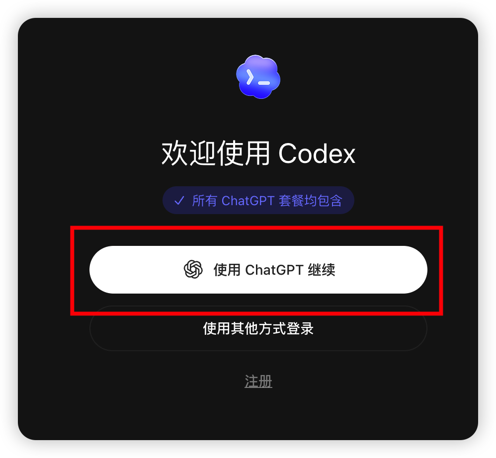

到输入电话号码这里，我们选择**【泰国】**。

> **如果你接码平台选择美国，那这里就选美国。**
>

**✅****注意：****这里是按拼音排序的，泰国在中间靠后的位置**🤔

<!-- 这是一张图片，ocr 内容为：LET ME THINK -->

<!-- 这是一张图片，ocr 内容为：电话号码是必填项 请继续添加电话号码.我们将向该号码发送一次 性验证码以进行验证. 美国(+1) 所罗门群岛+(677) 索马里+(252) 塔吉克斯坦+(992) 台湾+(886) 泰国+(66) 坦桑尼亚+(255) 汤加+(676) 特克斯和凯科斯群岛+(1) 特里斯坦-达库尼亚群岛+(290) 特立尼达和多巴哥+(1) 突尼斯+(216) 图瓦卢+(688) L口甘.(AA) -->
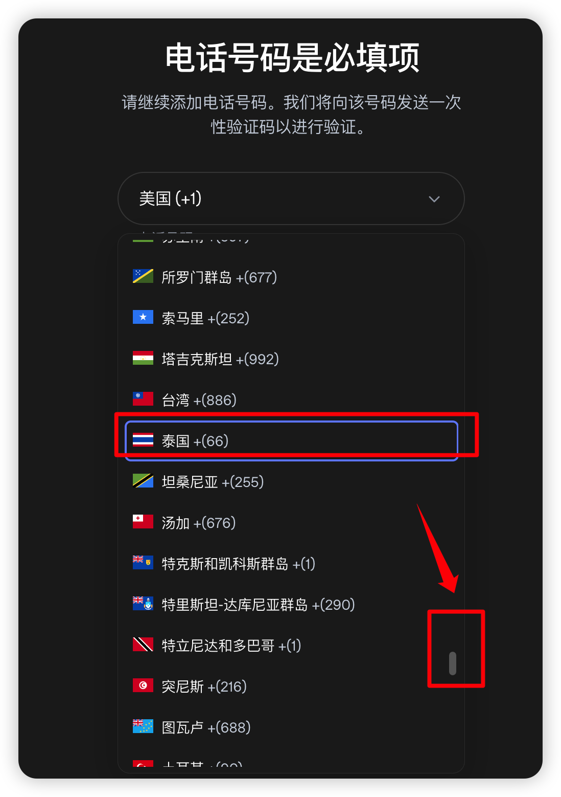

<!-- 这是一张图片，ocr 内容为：电话号码是必填项 请继续添加电话号码.我们将向该号码发送一次 性验证码以进行验证. 泰国(+66) 电话号码 +66 继续 使用条款 隐私政策 -->
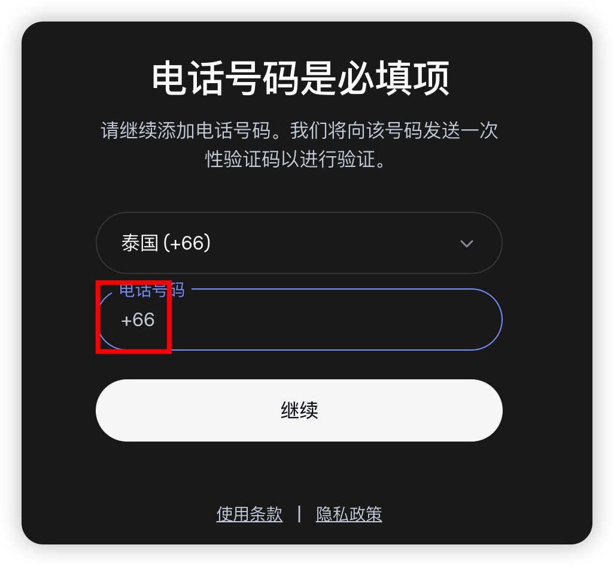

**✅****注意：****泰国的手机号是66开头的前缀，我们输入手机号的时候，就不要把66输进去了！**

## 7、等待短信
点击发送短信后，我们就在HeroSMS等待验证码的到来。

<!-- 这是一张图片，ocr 内容为： -->
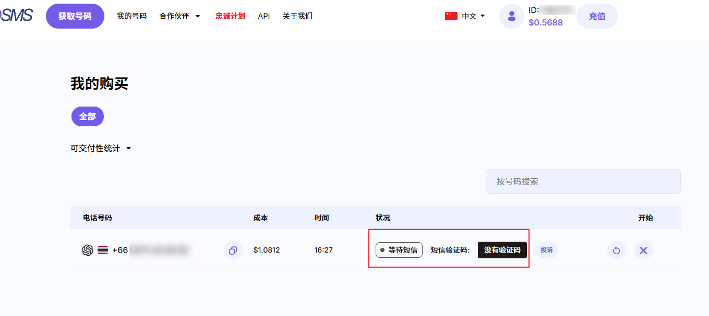

这里要等挺久的，我等了好几分钟，差不多十分钟，emmm。

<!-- 这是一张图片，ocr 内容为：硬撑 -->

**页面是可以刷新的，刷新后还能看到这个号码。**

接码成功是这样：

<!-- 这是一张图片，ocr 内容为：短信验证码 价格 国家 状态 日期 服务 号码 26.05.2026,20:39 成功 $1.0812 续期 216012 -->
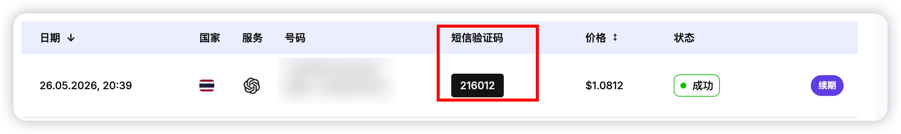

**接到验证码之后，把这个验证码填过去就行了。**

****

#### 7-1、失败情况
如果接不到，**平台会自动给你退款**，重新买一个就行了。

我第一次接码就失败了。下面画圈这里可以看到。

<!-- 这是一张图片，ocr 内容为：短信验证码 号码 价格 日期 服务 状态 国家 续期 216012 成功 26.05.2026,20:39 $1.0812 没有验证码 $1.0812 26.05.2026,20:31 已取消 -->
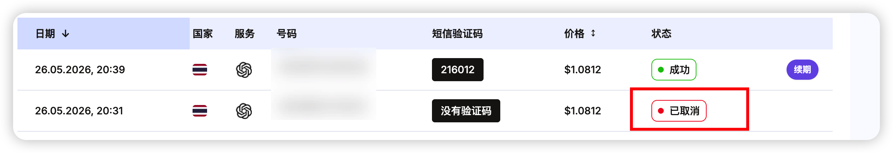

#### 7-2、历史记录
点击右上角的头像【激活历史记录】，可以查看你以前接码的短信号码。

<!-- 这是一张图片，ocr 内容为：HERISMS 充值 获取号码 忠诚计划 关于我们 API 中文 合作伙伴 我的号码 $0.5688 个人信息 激活历史记录 网站联盟 安全 个人信息 历史 安全 使用促销代码 号码 没有等级 退出 时间范围 最大允许请求周期为2周! 2026/5/13 2026/5/26 请求 所有国家 所有服务 总成功激活数: 导出CSV 按号码搜索 金额:$1.0812 短信验证码 号码 状态 日期 服务 国家 价格 +66 续期 26.05.2026,20:39 成功 216012 $1.0812 没有验证码 +66 已取消 26.05.2026,20:31 $1.0812 -->
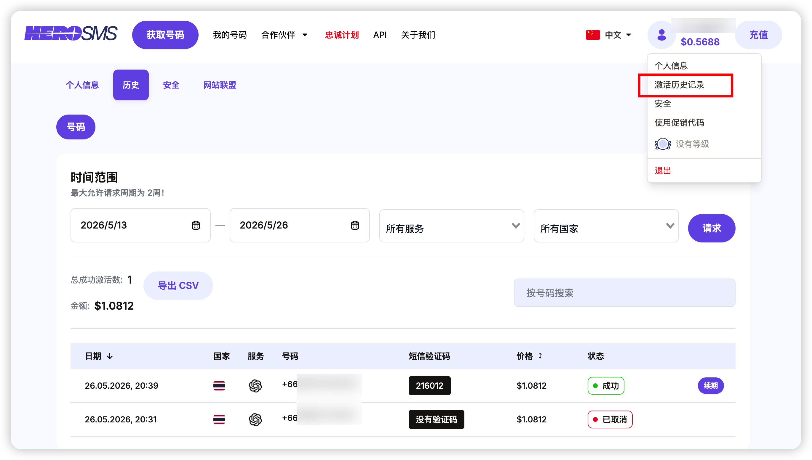

**至此，这就是Codex短信接码的整个流程了。**

<!-- 这是一张图片，ocr 内容为： -->

**我知道你一定会给我点个赞的吧～**

## 8、Codex二次登入
**这次你接码成功了，那下次你再登录Codex的时候怎么办呢？****🤔**

<!-- 这是一张图片，ocr 内容为：思索 -->

因为你已经绑过手机号，不会再弹出验证手机号了，所以直接通过`邮箱`+`验证码`登入就行了。

(目前2026-05-26日，OpenAI的政策是这样的，不代表以后也这样🤔)

**以后你就可以爽快地用Codex了。**

<!-- 这是一张图片，ocr 内容为：呀吼! -->

**我是卡卡罗特，每天持续分享对你有用的AI知识～ **

你的鼓励是我更新的动力，加个关注再走呗🥳～

